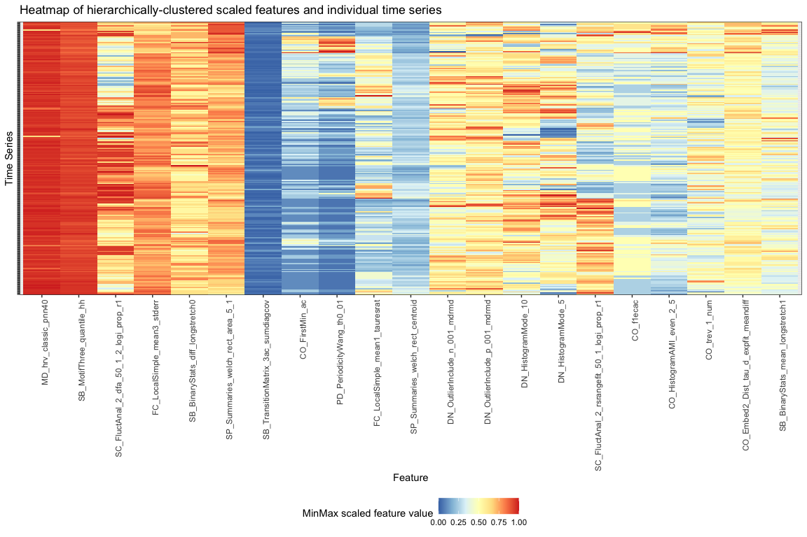

# catchEmAll 

CAnonical Time-series CHaracteristics for multiple domains - an
efficient implementation for `R` written as a package to calculate time
series features from [catch22](https://github.com/chlubba/catch22),
[catchaMouse16](https://github.com/DynamicsAndNeuralSystems/catchaMouse16),
and other reduced-redundancy feature sets.

## Installation

*Coming to CRAN soon… Stay posted\!*

You can also install the development version of `catchEmAll` from GitHub
using the following:

``` r
devtools::install_github("hendersontrent/catchEmAll")
```

## Motivation

The highly comparative time-series analysis approach to temporal data is
a data-driven and largely field agnostic one. Pioneered largely through
[Ben Fulcher’s](http://www.benfulcher.com) `MATLAB` toolbox
[`hctsa`](https://github.com/benfulcher/hctsa) and various associated
feature-based time-series analysis publications (such as [this
paper](https://arxiv.org/abs/1709.08055) and [this
paper](https://royalsocietypublishing.org/doi/10.1098/rsif.2013.0048)),
this approach has proven effective in detecting signal from noise,
classifying groups, and performing regression tasks. These performance
gains likely occur for several reasons:

  - **Feature space is much more computationally efficient than
    measurement space** - enabling a more diverse range of algorithms
    and statistical models to be fit to its outputs
  - **Feature space can reveal dynamical and nonlinear relationships
    between statistical processes that the measurement space may not be
    able to detect** - enabling a deeper and potentially more
    sophisticated understanding of the empirical structure and
    similarity between time series
  - **Dimension reduction techniques generalise well to the feature
    space** - enabling methods such as Principal Components Analysis and
    t-SNE to reveal patterns across groups of features, and promote
    effective data visualisation

Since `MATLAB` is proprietary software, a major barrier to broader
adoption of this philosophy of highly comparative methods is one largely
of the available tools. This package, `catchEmAll`, aims to bridge some
of this gap by providing convenience functions for the user that
automatically calculate different sets of features on any input time
series using the free open-source language
[`R`](https://www.r-project.org). Most (if not all) of the features that
are available in `catchEmAll` exist within the larger \>7,700 feature
set that comprises `hctsa`.

## Available functions

There are three core time-series functions in `catchEmAll` so far (where
`x` is a numerical time-series input vector):

1.  `catch22_all(x)`
2.  `catchaMouse16_all(x)`
3.  `catch_all(x)`

The first two functions `catch22_all()` and `catchaMouse16_all()`
automatically calculate individual summary statistics for each of the
time-series features included in their respective sets. If you want to
run all feature calculations in both sets at once, you can use the third
function `catch_all()` to achieve this. When future reduced-redundancy
feature sets are added, they will also get their own set-level call to
calculate the particular selection of features at once, as well as being
added to the general `catch_all()` function. Over time and with enough
additional feature set additions, the `catch_all()` function will likely
begin to approximate a respectable portion of the overall functionality
of `hctsa` - though this is very much a long-term goal.

An example for a single time series might look like the following:

``` r
library(catchEmAll)
x <- 1 + 0.5 * 1:1000 + arima.sim(list(ma = 0.5), n = 1000)
outs <- catchaMouse16_all(x)
```

### Individual feature calculations

If you do not want to or need to run the entire sets of `catch22_all()`
or `catchaMouse16_all()`, you can also access the individual feature
calculations as their unique function names, for example
`SC_FluctAnal_2_rsrangefit_50_1_logi_prop_r1(x)`.

### Plotting

`catchEmAll` also comes with a built-in plotting engine for visualising
output matrices as heatmaps. The function `plot_feature_matrix()` takes
the output of any of the above feature calculation functions, and
produces a `ggplot` object heatmap showing the feature vectors across
the `x` axis and each time series down the `y` axis. Prior to plotting,
the function hierarchically clusters the data across both rows and
columns to visually highlight the empirical structure. An indicative
graphic is presented below.

<!-- -->

### Pipeline considerations

Putting calculated feature vectors on an equal scale is crucial for any
statistical or machine learning model as variables with high variance
can adversely impact the model’s capacity to fit the data appropriately,
learn appropriate weight values, or minimise a loss function.
`catchEmAll` includes a convenience function `normalise_catch()` to
rescale a vector of values (e.g. vector of values for all participants
in a study on the `CO_AddNoise_1_even_10_ami_at_10()` feature) into a
variety of different ranges for ease-of-use. Current transformations
available in the package include:

  - z-score
  - Sigmoid
  - Outlier-robust Sigmoid (credit to Ben Fulcher for creating the
    original [MATLAB version](https://github.com/benfulcher/hctsa))
  - Min-max
  - Mean subtraction

As an efficient and scalable workflow is front-of-mind (in addition to
the requirement of relatively specialised normalising options), this
function has been coded in C++ which makes it compute faster than the
available functions in R (see below for trivial benchmarking example).
This function will be expanded into a full automated feature set scaling
operation on the output dataframes of the core time-series functions.

``` r
library(catchEmAll)
x <- as.vector(1 + 0.5 * 1:1000 + arima.sim(list(ma = 0.5), n = 1000))
microbenchmark::microbenchmark(normalise_catch(x, method = "MinMax"), scales::rescale(x, to = c(0,1)), times = 1000)
```

    Unit: microseconds
                                      expr    min      lq     mean  median    uq
     normalise_catch(x, method = "MinMax") 17.104 24.1675 34.92895 26.7885 30.08
          scales::rescale(x, to = c(0, 1)) 34.869 52.4505 60.74711 58.2100 63.63
          max neval
     6156.670  1000
      204.801  1000

## Available data

A tidy dataframe of all the included features and the set they each
correspond to is provided as a `.rda` file which can be viewed easily
using the following:

``` r
library(catchEmAll)
View(feature_list)
```

| feature\_set  | feature                                             |
| :------------ | :-------------------------------------------------- |
| catch22       | DN\_HistogramMode\_5                                |
| catch22       | DN\_HistogramMode\_10                               |
| catch22       | CO\_f1ecac                                          |
| catch22       | CO\_FirstMin\_ac                                    |
| catch22       | CO\_HistogramAMI\_even\_2\_5                        |
| catch22       | CO\_trev\_1\_num                                    |
| catch22       | MD\_hrv\_classic\_pnn40                             |
| catch22       | SB\_BinaryStats\_mean\_longstretch1                 |
| catch22       | SB\_TransitionMatrix\_3ac\_sumdiagcov               |
| catch22       | PD\_PeriodicityWang\_th0\_01                        |
| catch22       | CO\_Embed2\_Dist\_tau\_d\_expfit\_meandiff          |
| catch22       | IN\_AutoMutualInfoStats\_40\_gaussian\_fmmi         |
| catch22       | FC\_LocalSimple\_mean1\_tauresrat                   |
| catch22       | DN\_OutlierInclude\_p\_001\_mdrmd                   |
| catch22       | DN\_OutlierInclude\_n\_001\_mdrmd                   |
| catch22       | SP\_Summaries\_welch\_rect\_area\_5\_1              |
| catch22       | SB\_BinaryStats\_diff\_longstretch0                 |
| catch22       | SB\_MotifThree\_quantile\_hh                        |
| catch22       | SC\_FluctAnal\_2\_rsrangefit\_50\_1\_logi\_prop\_r1 |
| catch22       | SC\_FluctAnal\_2\_dfa\_50\_1\_2\_logi\_prop\_r1     |
| catch22       | SP\_Summaries\_welch\_rect\_centroid                |
| catch22       | FC\_LocalSimple\_mean3\_stderr                      |
| catchaMouse16 | SY\_DriftingMean50\_min                             |
| catchaMouse16 | CO\_AddNoise\_1\_even\_10\_ami\_at\_10              |
| catchaMouse16 | AC\_nl\_036                                         |
| catchaMouse16 | AC\_nl\_035                                         |
| catchaMouse16 | AC\_nl\_112                                         |
| catchaMouse16 | IN\_AutoMutualInfoStats\_diff\_20\_gaussian\_ami8   |
| catchaMouse16 | CO\_HistogramAMI\_even\_10\_3                       |
| catchaMouse16 | CO\_HistogramAMI\_even\_2\_3                        |
| catchaMouse16 | CO\_TranslateShape\_circle\_35\_pts\_statav4\_m     |
| catchaMouse16 | CO\_TranslateShape\_circle\_35\_pts\_std            |
| catchaMouse16 | DN\_RemovePoints\_absclose\_05\_ac2rat              |
| catchaMouse16 | FC\_LoopLocalSimple\_mean\_stderr\_chn              |
| catchaMouse16 | PH\_Walker\_momentum\_5\_w\_momentumzcross          |
| catchaMouse16 | PH\_Walker\_biasprop\_05\_01\_sw\_meanabsdiff       |
| catchaMouse16 | ST\_LocalExtrema\_n100\_diffmaxabsmin               |
| catchaMouse16 | SC\_FluctAnal\_2\_dfa\_50\_2\_logi\_r2\_se2         |

## Future directions

Additional time series feature sets will be be added to `catchEmAll`.
This may include coding entirely new feature sets, or coding features
from existing `R` packages such as
[`feasts`](https://feasts.tidyverts.org) and
[`tsfeatures`](https://cran.r-project.org/web/packages/tsfeatures/vignettes/tsfeatures.html)
in `C` or `C++` for computational efficiency and ease-of-comparison on
feature-space tasks such as classification and regression.

## Authorship notes

Original `catch22` features coded in `C` by Carl H. Lubba and original
`catchaMouse16` features coded in `C` by Imran Alam. `roxygen2`
documentation and additional C++ and C code/changes for these original
functions written by [Trent
Henderson](https://github.com/hendersontrent).

## Hex sticker

The current hex sticker is probably a placeholder - a more professional
one might come soon\!
